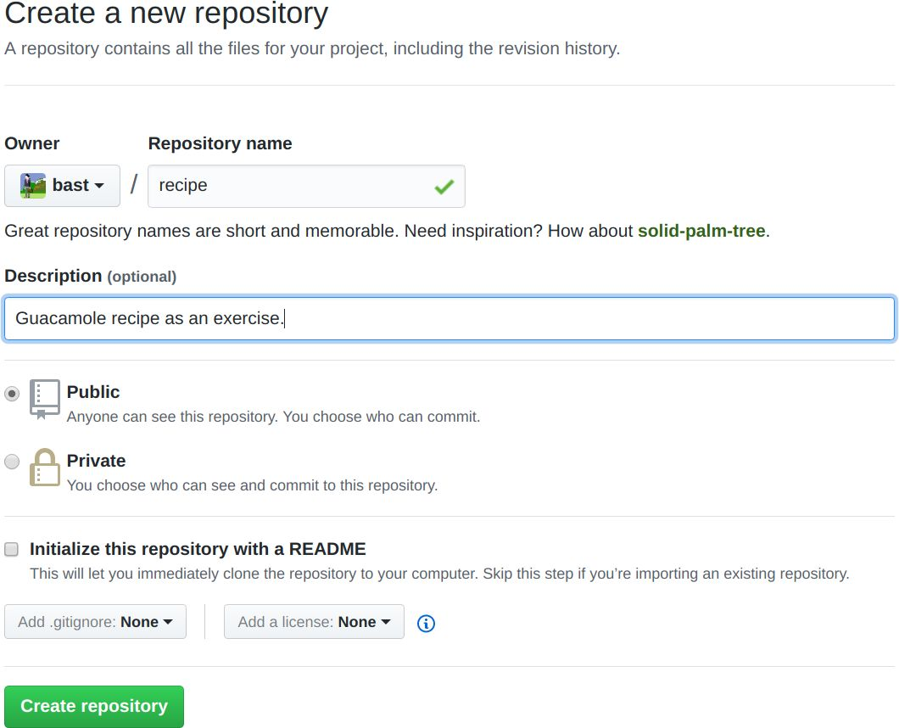
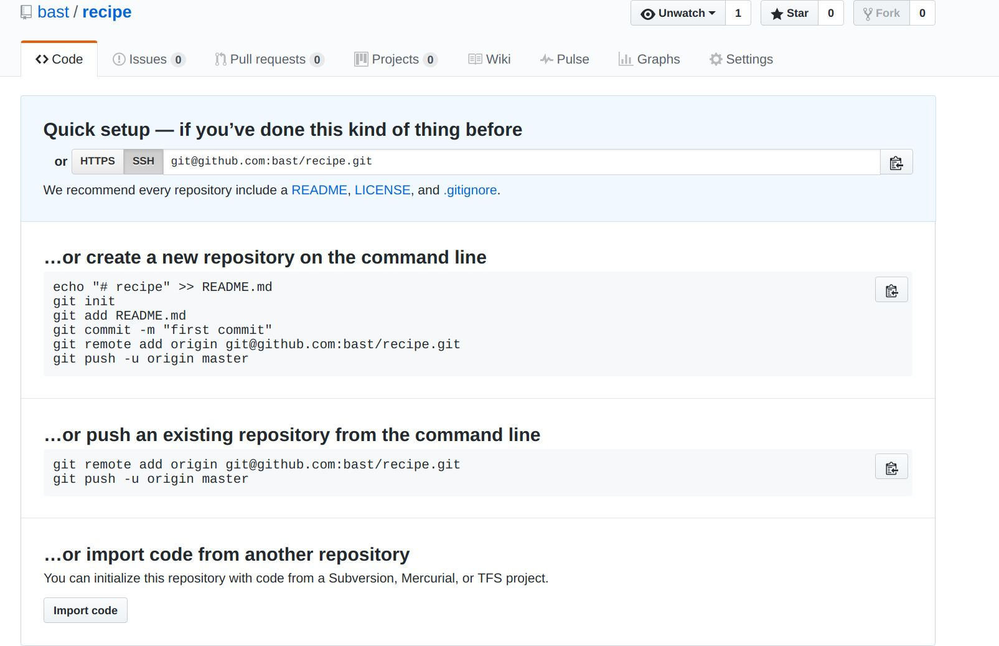

In this episode, we will publish our guacamole recipe on the web. Don't worry, you will be able
to remove it afterwards.


## From our laptops to the web

We have seen that **creating Git repositories and moving them around is
simple** and that is great.

So far everything was local and all snapshots are saved under `.git`.

If we remove `.git`, we remove all Git history of a project.

But...
- What if the hard disk fails?
- What if somebody steals my laptop?
- How can we collaborate with others across the web?

---

## Remotes

To store your git data on another computer, you use **remotes**.  A
remote is like making another copy of your repository, but you can choose to only
**push** the changes you want to the remote and **pull** the changes you need
from the remote.

You might use remotes to:
- Back up your own work.
- To collaborate with other people.

There are different types of remotes:
- [GitHub](https://github.com) is a popular, closed-source commercial site.
- [GitLab](https://about.gitlab.com) is a popular, open-core
  commercial site.  Many universities have their own private GitLab servers
  set up.
- [Bitbucket](https://bitbucket.org) is yet another popular commercial site.
- CSIRO has an enterprise bitbucket server [bitbucket.csiro.au](bitbucket.csiro.au)

---

## GitHub

One option to host your repository on the web is [GitHub](https://github.com).

GitHub is a for-profit service that hosts remote git repositories for you. It
offers a nice HTML user interface to browse the repositories and handles many
things very nicely.

It is free for public projects and hosting private projects costs a monthly fee
(but educational discounts exist). The free part of the service has made it
very popular with many open source providers.

---

## Set up GitHub account

By now you should already have set up a GitHub account but if you haven't,
please do so [here](https://github.com/join). 

---

## Create a new repository on GitHub

1. Login
2. Click on "Repositories"
3. Click on the green button "New"

On this page choose a project name (screenshot).

For the sake of this exercise **do not select**
"Initialize this repository with a README" (what will happen if you do?).




Once you click the green "Create repository", you will see a page similar to:



This effectively does the following on GitHub’s servers:  

```
$ mkdir recipe 
$ cd recipe
$ git init
```


## Linking our local repository to GitHub

To be able to send our local changes to GitHub, we need to tell the local repository that the one we just created on GitHub's servers exists. To do this, we create a 'remote'. Git repositories can have any number of remotes, although it is by far the most common to only use one. Each git remote is given a name so that it can be referred to easily. The default remote name is `origin`.

You'll see that GitHub has given us the instructions for how to do this under the option

> **... or push an existing repository from the command line**

1. Now go to your guacamole repository on your computer.
2. Check that you are in the right place with `git status`.
3. Copy paste the two lines to the terminal and execute those, in my case (**you
  need to replace the "user" part and possibly also the repository name if you gave it a different one**):

```shell
$ git remote add origin https://github.com/<user>/recipe.git
$ git push -u origin master
```

You should now see something similar to:

```
Counting objects: 4, done.
Delta compression using up to 4 threads.
Compressing objects: 100% (4/4), done.
Writing objects: 100% (4/4), 259.80 KiB | 0 bytes/s, done.
Total 4 (delta 0), reused 0 (delta 0)
To github.com:bast/recipe.git
 * [new branch]      master -> master
Branch master set up to track remote branch master from origin.
```

**Reload your GitHub project website and - taa-daa - your commits should now be
online!**

What just happened? **Think of publishing a repository as uploading the `.git` part online**.

When those two lines of code were run, two commands were given. The first was to add a reference to the GitHub repository, and call it `origin`.

The second was to push our local changes to that remote. That command was:

```
git push -u origin master
```

This is in the format:

```
git push -u <remote-name> <branch-name>
```

We won't cover branches in this lesson, but they are a way of working on parallel histories.

If you've got a simple repository with only one remote and one repository, you can simply run `git push`.


> ## Challenge 1
>
> Make a change to your project and commit the changes locally. 
>
> Push the changes to your GitHub remote.
> 
> What information can you access about the commit you just made?
{: .challenge}

## Getting changes from the remote

Of course we don't want information to only go one way - if the remote has changes to the project from a collaborator we need to get those onto our local machine. To do this, we're doing the opposite of a `push`, so it's helpfully called a `pull`.

> ## Challenge 2
> 
> Make a change to your repository using the GitHub web interface (look for the pencil icon to edit a file).
>
> Once you've made a change, use `git pull` in your terminal to get the changes onto your local machine.
>
> Inspect the history with `git log`.
{: .challenge}


Similar to `git push`, if you have multiple remotes and branches, you need to specify which you are referring to by using the format `git pull <origin-name> <branch-name>`, but for our purposes `git pull` is sufficient.
